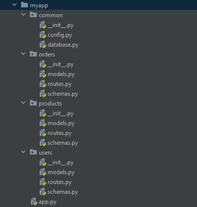

# Генератор файловой структуры
## Описание
Код генерирует файловую структуру, заданную в виде словаря, с помощью функций `parse_structure_string()` и
`generate_structure()`.

Функция `parse_structure_string()` парсит строку, которая содержит описание структуры, и возвращает словарь, где каждому
ключу соответствует вложенный словарь, в котором находятся дочерние элементы (файлы или директории) или None, если ключ
соответствует файлу.

Функция `generate_structure()` рекурсивно проходит по этому словарю и создает соответствующую файловую структуру в
файловой системе. Если значение ключа None, то создается файл с заданным именем, иначе - создается директория с заданным
именем.

Остальной код открывает файл, содержащий описание структуры, вызывает функцию `parse_structure_string()` для
преобразования строки в словарь, удаляет пустые значения из словаря, вызывает функцию `generate_structure()` для создания
файловой структуры в текущей директории.

## Пример
structure.src:
```structure.src
myapp/
--app.py
--users/
----__init__.py
----models.py
----routes.py
----schemas.py
--products/
----__init__.py
----models.py
----routes.py
----schemas.py
--orders/
----__init__.py
----models.py
----routes.py
----schemas.py
--common/
----__init__.py
----config.py
----database.py
```

Сгенерированная файловая структура:

